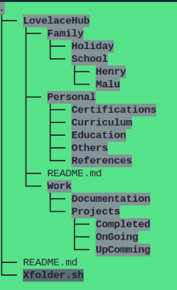

# LovelaceHub



Welcome to **LovelaceHub** — your simplified
platform for collaborative development! 

## 📦 Installation
Follow the steps below to install the project:
1. Run the setup script ⚙️

````
bash Xfolder.sh
````
2. You're ready to go! 
That's it! The magic will begin, and the folder structure will be created for you.


